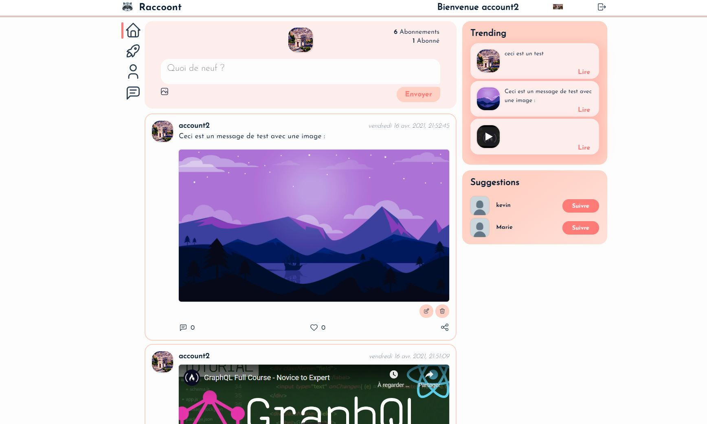

# MERN-Social-Media-project
# 🚀 Javascript Full-stack 🚀




## Stack :
* React
* Express
* MongoDB
* Redux
* Socket
* Realtime database
* Jwt
* Material UI
* BEM naming convention
_____________________________

## Features :
* Authentification (jwt and middleware)
* Sign up / Sign in
* Posts (Add / Delete / Modify), possibility to post video from youtube or image
* Comments (Add / Delete / Modify)
* Like / Unlike / Follow / unfollow
* Infinite scroll on Home page
* Trending page display few posts based on maximum like
* Profil (Modify profil picture / Bio)
* Realtime private chat with message store inside a database using mongoDB + socket.io
* Use local storage on client side for handling data

_____________________________
_____________________________

## Quick Started :
### Back-end configuration :
* Put your cluster info inside `/config/db.js`
* Create `.env` file inside `/config/` within the following data
  * PORT=`5000` your localhost port
  * CLIENT_URL=`http://localhost:3000` your client url
  * DB_USER_PASSWORD=`ID:password` your ID & password
  * TOKEN_SECRET=`your random secret key`

__Start server :__ 
```bash
npm start
```

### Front-end configuration :
* Create `.env` file inside `/client/` within the following data 
  * REACT_APP_API_URL=`http://localhost:5000/` your server url

__Start client :__
```bash
cd client
npm start 
```
_____________________________
_____________________________

## Why this project :
I'm learning web development because that interest me. Now this project is created by learning from FromScratch (https://www.youtube.com/channel/UCHGLV13U7YRbjrKpqfbtyYg) thanks to him for sharing free class on google. 

In reality this project is the first project i start when we talk about web development. I learn a lot from this project and i notice some little thing who need to be changed (for exemple the password are sending back inside the project when a request is created to follow/unfollow and like/unlike people so i fix this issue.). 

Other thing i noticed when i'm learning, the first project isn't able to handle data base in realtime, what i mean by that is fact if a user A send a post then the user B will see the post only when the page are refresh. That's not a big deal in this cases but here we can see something whose need to be improved. That's why i decid to implement a Private messagerie inside this project for 2 reasons :
1.  Reinforce knowledge by practicing because when i'm learning i find really interesting this project and architecture choice
2.  Challenge and try to create a solution for handling realtime database using socket.io


## What i learn and practice from this project :
  - A architecture or way to organise code for back-end and front-end side, and by using it i find it really interesting and well thinking. Even if i'm feeling like the folder styles maybe is not so usefull because i find more interesting to place css inside the folder of corresponded components using BEM convention like the whatsapp clone for exemple but i still find interesting `settings.css`, because often when we create a design for a website or application then we use only few different fonts and colors then be able to change them directly using only one files are nice. 
  - Create MongoDB database, create an API, Scrud for the backend
  - Using Jwt for authentification with middleware
  - Socket.io really usefull to do realtime communication, in this project i use it like a push notification for notify the client that a data have been changed inside the room whose handle the current private chat and i send the notification only to the members of the private conversation. Then the client can simply ask the data only when it's needed. I know that's not the right way for use socket.io in reality it's a lot of more easier to handle directly with socket.io all the realtime communication and storage inside database for this purpose but what i want to do here is something similar to pusher.io (which is not a free libs) and want to make something a little bit similar to firebaseDB. So i take a better understand on how it's work and now i want take a look at GraphQL wich can handle realtime database directly using socket behind the scene.  
  - Practicing complete back-end and front-end
  - Using __`Wiki`__ on github for write documentation and explaining choice and implementation inside this app. 

## Some reflexion about the project and realtime database :
With some research i find GraphQL a lib wich allow us to use realtime database directly because it's working with socket behind the scene. I didn't use it simply because i created this project for learn, understand concept and practicing. But from what i see, this stach offer good dev tool whose will provide a good documentation of all our http request implemented from the back-end so i guess it's very nice feature because that's can allow us to write less documentation and then speed up the process of programming. 

So GraphQL will certainly be something that i will look into it and realise project using it in futur.  

The way to handle organisation for a project based on : `client / server side`. 
